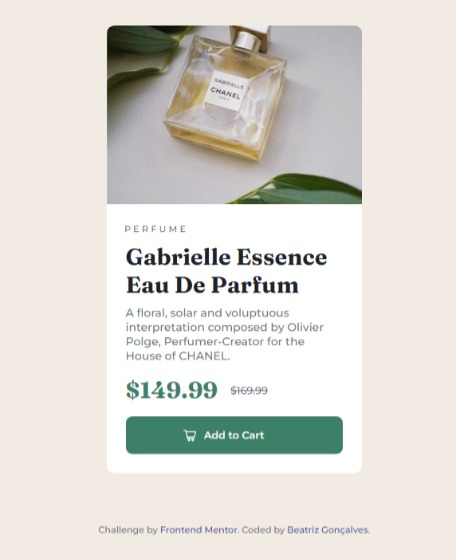

# Frontend Mentor - Product preview card component

Essa é a solução para o [desafio do Frontend Mentor - Product preview card component](https://www.frontendmentor.io/challenges/product-preview-card-component-GO7UmttRfa). Os desafios do Frontend Mentor ajudam você a melhorar suas habilidades de codificação através da construção de projetos realistas.


## Tabela de conteúdos

- [Frontend Mentor - Product preview card component](#frontend-mentor---product-preview-card-component)
  - [Tabela de conteúdos](#tabela-de-conteúdos)
  - [Visão Geral](#visão-geral)
    - [Screenshot](#screenshot)
    - [Links](#links)
  - [Meu processo](#meu-processo)
    - [Construído com](#construído-com)
    - [O que eu aprendi](#o-que-eu-aprendi)
    - [Desenvolvimento contínuo](#desenvolvimento-contínuo)
  - [Autora](#autora)


## Visão Geral


### Screenshot





### Links

- URL da solução: [https://github.com/beatrizvsgoncalves/product-preview-card-component-main](https://github.com/beatrizvsgoncalves/product-preview-card-component-main)
- URL do site: [https://beatrizvsgoncalves.github.io/product-preview-card-component-main/](https://beatrizvsgoncalves.github.io/product-preview-card-component-main/)


## Meu processo


### Construído com

- HTML5 semântica
- CSS Grid
- Flexbox
- Mobile-first workflow

(Não consegui tirar uma captura de tela, mas o botão fica com a cor diferente quando ativo, assim como foi pedido no desafio)


### O que eu aprendi

No desenvolvimento deste projeto eu aprendi um pouco a usar o grid. Ainda não aprendi esse conceito no meu curso então dei uma suada para terminar esse projeto.

```css
main {
    display: grid;
    gap: 0;
    grid-template-columns: 1fr 1fr;
    grid-template-rows: auto;
}
```


### Desenvolvimento contínuo

Gostei muito de desenvolver este projeto, eu consegui estimar com precisão o tempo que eu levaria para concluí-lo, que foi o tempo de 4 horas. Como estou no começo de meus estudos e ainda não aprendi grid, estou bem satisfeita.


## Autora

- Github - [beatrizvsgoncalves](https://github.com/beatrizvsgoncalves)
- LinkedIn - [beatriz-vs-goncalves](https://www.linkedin.com/in/beatriz-vs-goncalves/)
- Frontend Mentor - [@beatrizvsgoncalves](https://www.frontendmentor.io/profile/beatrizvsgoncalves)


